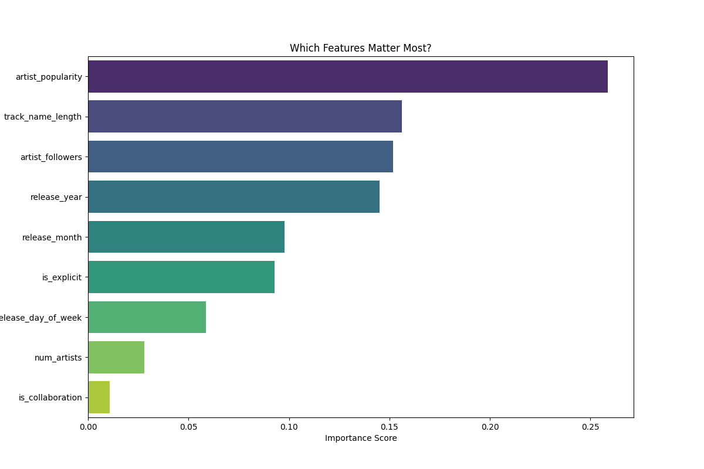

# 🎵 Chart Predictor: A Spotify Hip-Hop Popularity Model

This is a data science project that trains a machine learning model to predict a Spotify song's popularity score. The model is trained on a custom, pre-built dataset of **7,500+ tracks**, derived from the discographies of 30+ major hip-hop artists.

The final `RandomForestRegressor` model achieves an **R² score of 0.66**, demonstrating a strong ability to predict 66% of a song's inherent popularity based *only* on its pre-release metadata.

## 📝 Key Findings: What Makes a Hit?

The most important part of the analysis was to see which features the model found most predictive. The single most powerful feature was **`artist_popularity`**, proving that an artist's existing fame is the biggest driver of a new song's success.

However, features I engineered myself, such as `track_name_length` and `artist_followers`, also showed significant predictive power.



*(This plot is generated by `train_model.py` and saved as `feature_importance.png`)*

---

## ⚡ How to Run This Project (10-Second Demo)

This project is "decoupled." You **do not need API keys** to run the pre-trained model, which uses the included `model_ready_data.csv` file.

1.  **Clone the Repository**
    ```bash
    git clone git@github.com:sokar-src/chart-predictor.git
    cd chart-predictor
    ```

2.  **Set Up the Environment**
    ```bash
    # Create a virtual environment
    python3 -m venv .venv
    # Activate it
    source .venv/bin/activate
    # Install all required libraries
    pip install -r requirements.txt
    ```

3.  **Run the Model Training Script**
    This script will load the pre-built `model_ready_data.csv`, train the model, print the final R² score, and save the feature plot, all in about 10-15 seconds.
    ```bash
    python3 train_model.py
    ```
    You will see the final output:
    ```text
    ...
    R²: 0.66

    ```

---

## 🛠️ The Process & Methodology

This project was built as a two-stage pipeline:

### 1. Phase 1: Data Collection

I built a robust, multi-file data pipeline (`main.py`, `get_data.py`, `artist_list.py`) using the `spotipy` library to scrape all 7,500+ songs.

* **The Pivot:** My initial plan was to use Spotify's `audio-features` endpoint, but it was deprecated/blocked (returning a `403 Forbidden` error). I pivoted to a **metadata-only model**.
* **The Bug Hunt:** My first attempt at scraping artist discographies (the "Artist Method") returned 25,000+ songs for a single artist. I debugged this and found the `sp.artist_albums()` call was including all **"appears_on"** features.
* **The Fix:** I made the script resilient by:
    1.  Limiting the `album_type` to `"album,single"` to get only an artist's official work.
    2.  Implementing a **robust retry loop** with `time.sleep()` to handle the frequent `ReadTimeoutError` and network instability during the multi-hour scrape.
    3.  Building the script to fetch data in **batches** (e.g., 30 artists at a time) to respect API rate limits and build the dataset incrementally.

### 2. Phase 2: Feature Engineering

In the `explore_data.ipynb` notebook, I loaded the raw data and engineered 9 new features. This "enriched" data was then saved to `model_ready_data.csv`.
* `artist_popularity` & `artist_followers` (from new `sp.artists()` calls)
* `is_collaboration` & `num_artists` (from `artists_full`, handling edge cases like "Tyler, The Creator")
* `release_year`, `release_month`, & `release_day_of_week` (from `release_date`)
* `track_name_length`
* `is_explicit`

### 3. Phase 3: Model Training

I used `scikit-learn` to train a `RandomForestRegressor` model on the cleaned, engineered data to predict `popularity`. The final, clean script for this is `train_model.py`.

---

## 📂 Project Structure

```text
chart-predictor/
│
├── .gitignore            # (Ensures secrets, venv, and raw data are not pushed)
│
├── artist_list.py        # (The master list of artists to scrape)
├── get_data.py           # (Contains all worker functions)
├── main.py               # (Executes the data collection pipeline)
│
├── explore_data.ipynb    # (My scratchpad for analysis and model testing)
├── train_model.py        # (The final, clean script to train/evaluate the model)
│
├── model_ready_data.csv  # (Small, clean, engineered data - INCLUDED IN REPO)
├── raw_data.csv          # (Large raw file - NOT IN REPO, generated by main.py)
│
├── requirements.txt      # (A clean list of all project dependencies)
└── README.md             # (This file)

---
